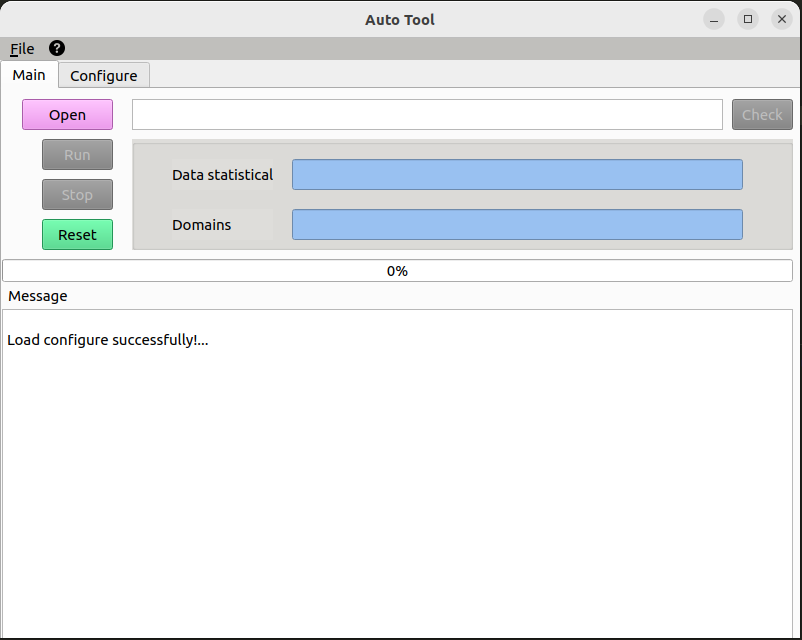
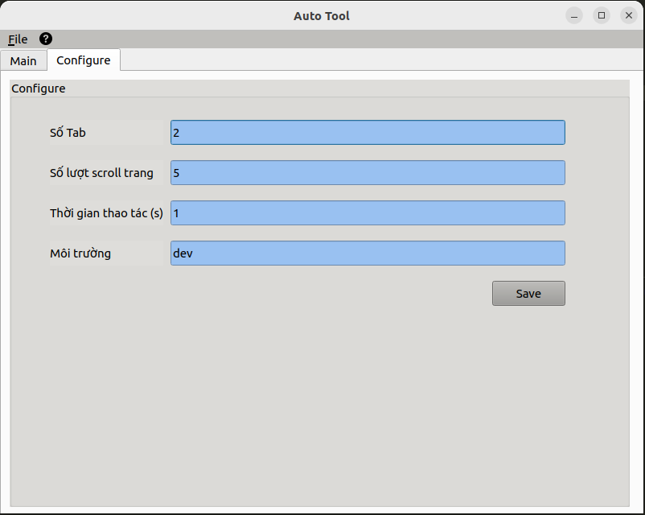

## Introduction
```
This application aims to control how we will automatically access the target webpage with interactives.
This idea is from my friendship who needs to increase the views on the page.
```


## Installation
- pip install -r requirements.txt


## For run
* QT Design:
    - pip install pyqt5-tools  | ```pyqt5-tools designer```
      OR sudo apt-get install qttools5-dev-tools   | ```qt design```
    - Exporting GUI: pyuic5 -x "filename".ui -0 "filename".py
* Run application: ```python app.v2.py```


## Demo




## License
```
@application{autotool,  
    address = {VN},  
    author = {tuanlh},
    email = {tuanlh.work@gmail.com},  
    year = {2023}  
}
```