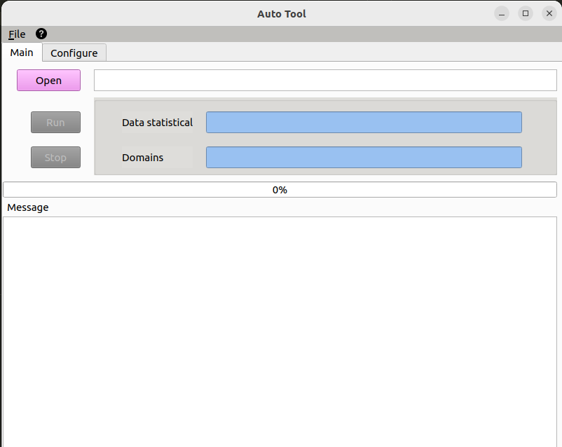

## Installation
- pip install pyqt5-tools
- pip install -r requirements.txt


## Run
* qt design:
    - pip install pyqt5-tools  | ```pyqt5-tools designer```
      OR sudo apt-get install qttools5-dev-tools   | ```qt design```
    - Exporting GUI: pyuic5 -x "filename".ui -0 "filename".py
* App: ```python app.v2.py```


## Demo


## License
```
@application{autotool,  
    address = {VN},  
    author = {tuanlh},
    email = {tuanlh.work@gmail.com},  
    year = {2023}  
}
```